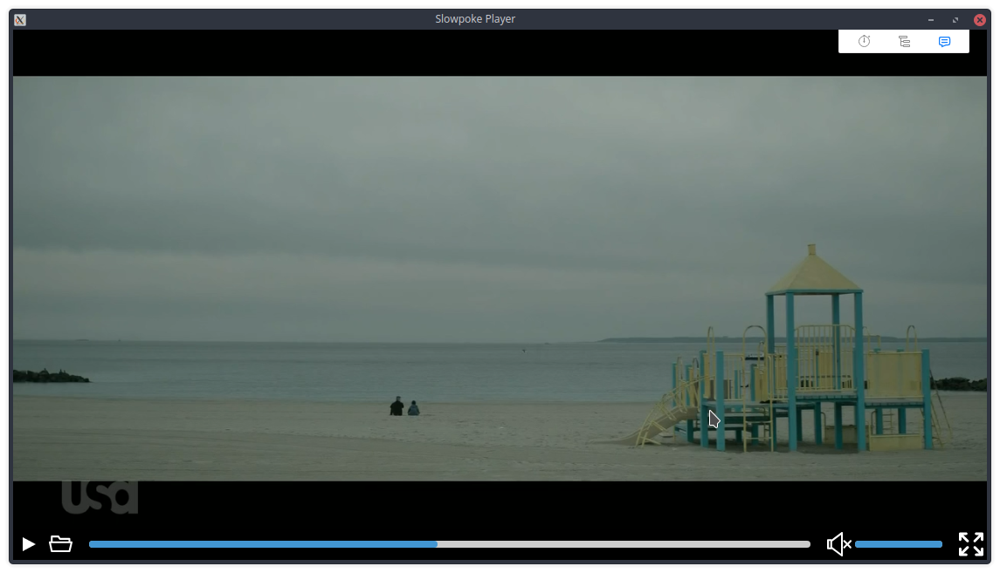

This is a simple video player to showcase [`libmpvjs`](https://github.com/zenwarr/libmpvjs) library.

`libmpvjs` is a libmpv bindings to node that can render anything mpv can, but inside Electron (on canvas).
It was a small art therapy project (if you can take programming for art) and it is not intended for any real usecase.
It is pretty bad actually.

Here it is.

And it is called `Slowpoke Player` because it is slow.

It uses an old version of Electron which is not going to run on more recent Linux distros.
I managed to run it 3 years later on Ubuntu 17.10 with node v12.
Just run `npm ci` and (`npm run start` or `npm run dev-server`).
